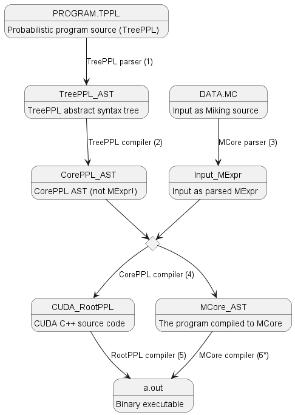

```
title:  'TreePPL Compiler Hacker's Handbook'
author:
- Viktor Senderov
- Viktor Palmkvist
keywords: [miking, compiler]
abstract: |
  This document explains how the TreePPL compiler (part of Miking) works and can be used as a reference or for on-boarding new compiler developers to the TreePPL project.
```

# TreePPL Compiler Hacker's Handbook

Hi, and welcome to the TreePPL compiler! In this guide you will find information on the intricacies of the TreePPL compiler, how to setup your development environment, and hopefully, after reading it you will be well-equiped to start contributing to the project!
This is also a reference for experienced developers.
For this reason it will start with the very basics but also cover some advanced aspects of compiler development.

## What is TreePPL?

[TreePPL](https://treeppl.org) is a high-level probabilistic programming language (PPL) build within the [Miking](https://miking.org) platform.
Its primary domain is phylogenetics and evolutionary biology.
It can be thought of as a statistical modeling language with a focus on tree data structures.

## Getting started with TreePPL development

### Installation and prerequisites

In order to get started with TreePPL development you need to install both the `miking` and the `miking-dppl` packages from GitHub.
To install `miking`, follow the instructions in the [Miking README](https://github.com/miking-lang/miking), but in a nutshell, if you have all the necessary prerequisties such as OPAM, O'CAML, etc., you checkout the `develop` branch and issue from the `miking` directory:

```
make clean
make install
cd stdlib; export MCORE_STDLIB=`pwd`; cd ..;
```

TreePPL itself is not a stand-alone package (2022-09-30), but rather it is a part of `miking-dppl`, and it is found under the `treeppl/` directory.
The installation of `miking-dppl` has several steps.
First, you  install [CorePPL](https://miking.org/docs/miking-dppl#coreppl), which is an intermediate level probabilistic programming language, to which all TreePPL programs compile to.
CorePPL can be thought of a probabilistic extension of the base Miking language, MCore.
[MCore](https://miking.org/docs/miking#mcore) itself consists of two components: MExpr, which is an MCore expression, and MLang, which is a language for defining languages.
Then, from the `miking-dppl` directory you issue:

```
make 
make install
```

Then, to install the TreePPL compiler itself, `tppl`, you issue:

```
make install-treeppl
```

To unistall it

```
make uninstall-treeppl
```

This behavior is programmed in the `Makefile` in the root of `miking-dppl`.
There is another makefile, under `treeppl/Makefile`, which holds the recipe for building `tppl`.

In certain circumstances you may need to install the CUDA C++ backend compiler itself, RootPPL `rppl`.

```
make install-rootppl
```

### How does compilation work?

To get started with hacking on `tppl` you need to first understand how compilation works.
Let's take the simple "flip" example, found under `models/flip/`.
Here, you will find three files: 

  - `flip.tppl`, which is the TreePPL program source,
  - `data.mc`, which is a MCore source file, containig input as bindings (temporary measure),
  - and `flip.mc`, which is a test CorePPL source file (same filename extension as MCore!); it contains the compiled-to-CorePPL instructions, to which the tests will compare the `flip.tppl` + `data.mc` after it has been compiled to CorePPL :)

There are three ways to compile this program:

  1. Build the `tppl` compiler, and use it to compile the program,
  
  ```
  make build/tppl
  build/tppl models/flip/flip.tppl models/flip/data.mc
  ```

  2. Interpret the `tppl` compiler using Miking,
  
  ```
  mi run src/tppl.mc -- models/flip/flip.tppl models/flip/data.mc
  ```

  3. Run the `tppl` compiler using the Miking bootstrap interpreter

  ```
  boot eval src/tppl.mc -- models/flip/flip.tppl models/flip/data.mc 
  ```

Method 1 is the fastest and is the one that the users will use.
However 2 and 3 might be used for debugging, more about this in the 
TODO Debugging chapter.

Regardless of which method you use, the actual compilation process is the same.
Here is the compilation pipeline:



In other words, the TreePPL program is parsed (1), then compiled to a CorePPL program (2), which is concatenated with the parsed data (3), then the CorePPL compiler (4) produces either a RootPPL C++ program (`.cu`), or a Miking MCore program (`.mc`). The RootPPL program can be compiled with `rppl` (`rootppl` previously) (5) to get an executable. The default behavior, is, however, for the Miking compiler `mi` (6) to be executed as part of the TreePPL compilation, which produces the executable.

These steps will be discussed in detail later
but now let's look at the individual components of the compiler.

### Setting up the programming environment and debugging

The easiest way to setup your development environment is as follows: let's say you are working on a feauture, e.g. "for loops for TreePPL".

1. Write a test-case: `models/for/for.tppl` and `models/for/data.mc`.  You would also want a `models/for/for.mc`, which will be the CorePPL program, which `for.tppl` should compile into.
2. You want your development loop to be:
  - edit the compiler library `src/compile.mc`, and when you do a change, attempt to compile the test-case;
  - by default `tppl.mc` will dump the generated CorePPL to `stdout` as well;
  - if an error is encountered, or the AST does not look right, go back...
3. Finally you want to write one or more unit
tests, using `utest [...]`

(2022-10-23 vsenderov TODO) explain writing tests.

To monitor the compiler for changes you might use something like [entr](https://eradman.com/entrproject/). For example:

```
find src/ | entr 'mi run src/tppl.mc -- models/for/for.tppl models/for/data.mc'
```

For debugging, there are various printing functions in Miking, the most useful are:

- pretty printing `print`: this one is useful when Miking knows how to pretty print the object (TODO I feel like this has to be explained better)
- and `dprint`, which is useful when `print` doesn't work, for example to dump ASTs.  To `dprint`, however you would need to compile with `boot`.


## Components of `tppl`

### Compiler command-line `src/tppl.mc`

The current command-line arguments of `tppl` are the input TreePPL program and the input MCore data.  E.g.:

```
tppl PROGRAM.tppl DATA.mc 
```

(2022-09-29 vsenderov) This is a temporary solution, and in the future the the DATA argument will be removed as input and output will be taken care by calling I/O functions (e.g. reading from a JSON file) inside PROGRAM.  In addition the `tppl` compiler in the future might take some toggles or switches.  Furthermore, command line parsing is very rough in the moment, and it needs a more generic solution, perhaps the one taken from the CorePPL compiler itself.

Architecturaly however, the command-line `tppl` takes care of understanding the command-line arguments and calls the parser on the input program(s).  It then calls the compiler on the generated AST(s) with the correct options to generate the needed ouptut (CUDA RootPPL or Miking MCore).

### Parser specification `treeppl.syn`

The parser relies on the framework Tool (`tool.mc`) that vipa developed. The parser itself `treeppl-ast.mc` is generated on the fly by Tool by the syntax specification `treeppl.syn`.  In addition to the parser we need some helpers that are in `tppl-lexer-extensions.mc`.

(2022-09-29 vsenderov TODO) Rhe syntax stuff might be moved to the directory `syntax/`.

### Library for compiling TreePPL to CorePPL `src/treeppl-to-coreppl/compile.mc`

The essential part of the compiler is under `src/treeppl-to-coreppl/compile.mc`, which is included from `tppl.mc`. 

(2022-09-29 vsenderov) Currently, the only target is CorePPL, but we have decided to use this directory tree-structure to follow Miking-DPPL conventions. 


## Syntax Parsing

(23-10-2022 vsenderov TODO) 

## The basics of compilation

In this section we discuss the larger picture of how to get from a parsed TreePPL program, i.e. AST (datatype `FileTppl`) to an internal representation as a CorePPL program (datatype `Expr`).  In other words, after the TreePPL program has been parsed it produced a thing of type `FileTppl` which will be converted to a thing of type `Expr` by the compiler.


Note that the intermediate CorePPL language extends the `Expr` datatype with probabilistic features, therefore the CorePPL AST is still an `Expr`.  A full discussion of how types and language fragments work in Miking is beyond the scope of this document and the reader is advised to consult the [Miking documentation](https://miking.org/docs/miking); however, a brief summary containing working knowledge to get going with TreePPL development follows.

There are two ways to define _types_ in Miking.  One is outside of a language fragment with the `type` keyword.  Here is an example of how to define a _tree_ type like this:

```
-- Tree type definition
type Tree
con Node : {left : Tree, right : Tree, age : Float } -> Tree
con Leaf : {age : Float} -> Tree
```

A type describes the shape of a thing, and note that in Miking, multiple shapes may be allowed.  In the example above, a `Tree` can have the shape `Node` as specified by the node constructor `con Node`, or the shape `Leaf` as specified by the leaf constructor `con Leaf`.  We are not going to discuss the constructor syntax in detail, but note that recursion is allowed.  E.g. the node constructor constructs a `Tree` by taking a left `Tree` and a right `Tree` and mixing them with a `Float` age.

The other kind of type is a syntactic form, which is a way to describe a type within a language fragment.  For example as mentioned above, the CorePPL language extends the standard `Expr` type, by defining how to constructs for probabilistic operations:

```
lang MExprPPL =
  CorePPL + MExprAst + MExprPrettyPrint + MExprEq + MExprSym +
  MExprTypeCheck + MExprTypeLift + MExprArity
...
lang CorePPL =
  Ast + Assume + Observe + Weight + ObserveWeightTranslation + DistAll
...
lang Assume = Ast + Dist + PrettyPrint + Eq + Sym + TypeCheck + ANF + TypeLift

  syn Expr =
  | TmAssume { dist: Expr,
               ty: Type,
               info: Info }
...
lang Observe = Ast + Dist + PrettyPrint + Eq + Sym + TypeCheck + ANF + TypeLift

  syn Expr =
  | TmObserve { value: Expr,
                dist: Expr,
                ty: Type,
                info: Info }
```

Several things ought to be discussed here:

  - within language fragments, types are defined with the syntax `syn ...`;
  - you can have multiple shapes for a type, the shapes are defined by constructors with a match like `| ConstructorName`;
  - types are defined within language fragments, and language fragments can be composed with `lang A = B + C`.

There are two more things to introduce here before we move on to actual TreePPL.  Besides types, language fragments allow for interpreters, i.e. operations on types to be definied with `sem ...`.  Those interpreters are functions, whose last argument is always of the type that we want to transform, and we have cases for the many ways a type can be constructed.  Finally, using the keyword `using ...` a language fragment can be imported in the current namespace and the syntax and semantics it defined can be used. An analogy can be drawn to object-oriented programming: language fragments are classes, they define a type and operations over that type; also language fragments can be combined, whereas things that one language defined are inherited by another language fragments (multiple inferitance as you can inherit from many language fragments).

Let's now look at the TreePPL compiler:

```
lang TreePPLCompile = TreePPLAst + MExprPPL + RecLetsAst 
  sem compile: Expr -> FileTppl -> Expr
  sem compile (input: Expr) =
  | FileTppl x -> 
```

The main compiler function `compile` is an interpreter defined in the `TreePPLCompile` language fragment.  `TreePPLCompile` inherits some functionality from `TreePPLAst` (auto-generated by the parser), `MExprPPL` (everything from CorePPL), and `RecLetsAst` (useful special things).  `compile` itself has two arguments of types `Expr` and `FileTppl` and outputs an `Expr`.  Its last (second) argument is of type `FileTppl`, which is type to which a TreePPL file is parsed to.  We name this argument `x` is in the first and only match after the definition `| FileTppl x`.  Note that we could also match on a constructor here, but in this case it is not needed, since there is only one way a `FileTppl x` can be constructed, namely by parsing the input file.

Further, the first argument of `compile` is an `Expr`, i.e. the input data, and the last argument is `Expr` as well, namely the output CorePPL program.

## Handling of externals

(23-10-2022 vsenderov) This is section still a work-in-progress.  Placeholder text from the PR.

This PR attempts to add externals support to TreePPL.

We introduce two new functions, which may need to be moved to externals.mc

sem constructExternalMap : Expr -> Map String Name
sem filterExternalMap: Set String -> Expr -> Expr
Then we parse a runtime, which only includes dist-ext.mc and math-ext.mc, we filter only the externals that we need, we run symbolize on the filtered externals, then we construct a map from the identifier strings to the Names for the externals, and finally we retrieve the Names of the externals that we need by searching this map. Finally, to use an external we utilize (app_ (nvar_ NAME)), whereas NAME is the name we just found and is passed around with a TpplCompileContext record.

Currently, there is an issue in mexprCompile. To reproduce the issue, attempt to compile any of the examples:

miking-dppl/treeppl$ mi run src/tppl.mc -- models/externals/externals.tppl models/externals/data.mc 
checkpoint 1

FILE "/home/viktor/Dropbox/Work/miking/stdlib/ext/math-ext.mc" 25:0-25:37 ERROR: Error in exprName for CFA
external externalLog : Float -> Float

miking-dppl/treeppl$ 


## Data input and locating where is the main "model" function

TODO

## Compiling function declarations and arguments

TODO

## Compiling types

TODO

## Compiling statements

### Probabilistic statements

### If statements

## Compiling Expressions

## Writing tests

## Community stuff
 
### How Miking PR's work, etc.

### Updating the website doco